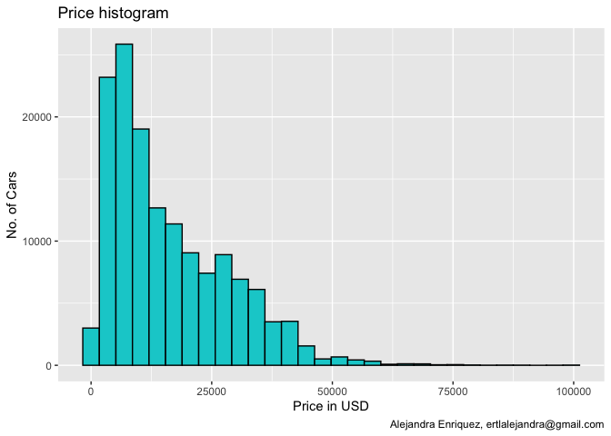
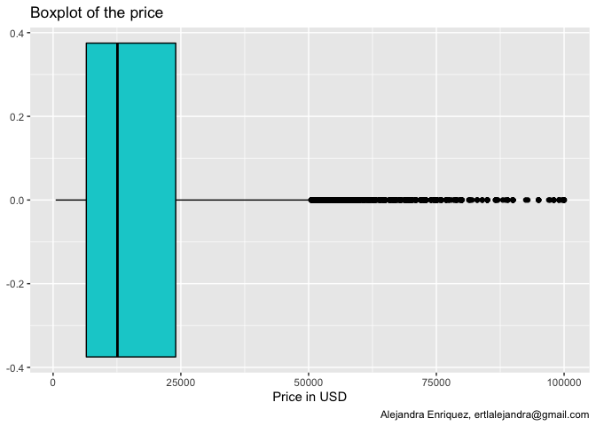
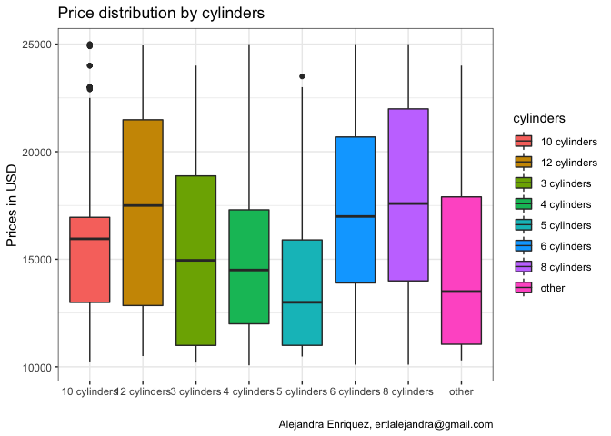
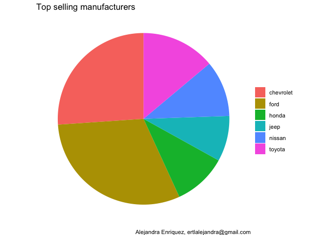
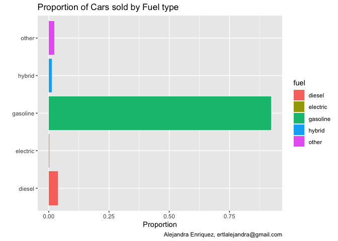
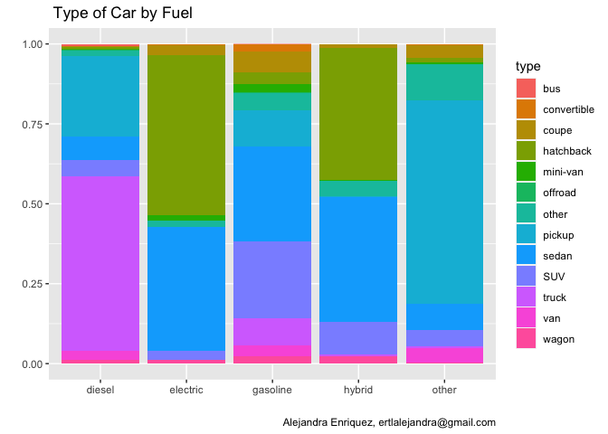
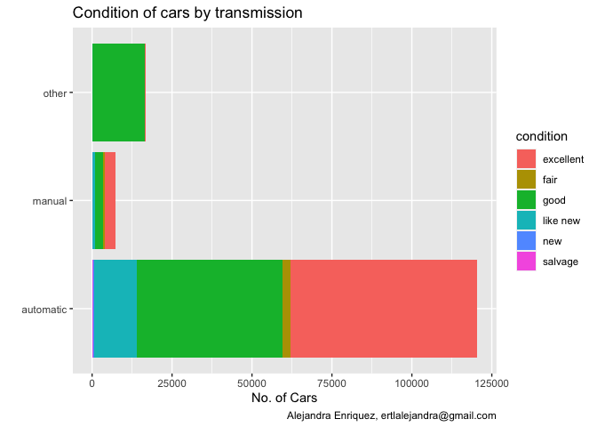
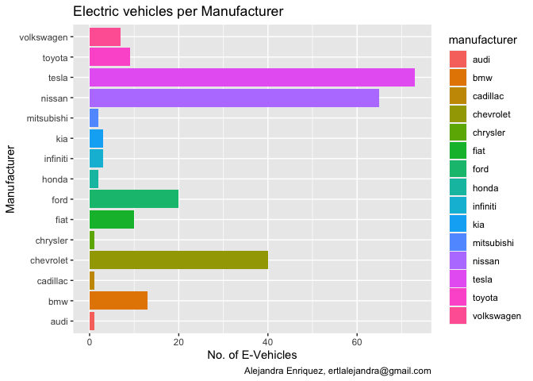
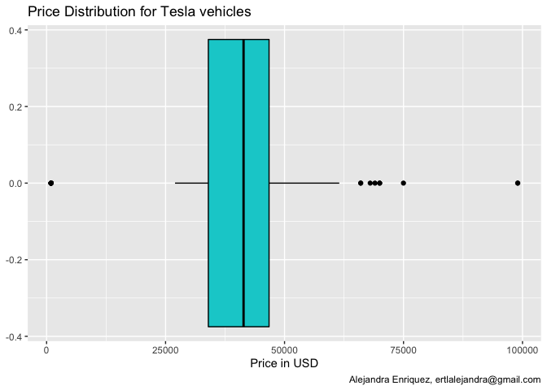

```r
knitr::opts_chunk$set(fig.path='Figs/')
```
# Cleaning the data base

```r
#install.packages("tidyverse")
#library(tibble)
#as_tibble(carros)
#glimpse(carros)

carros <- read.csv("vehicles.csv")

drop <- c("X","id","url","region","region_url","VIN","image_url","description","state","lat","long","posting_date")
carros_clean = carros[,!(names(carros) %in% drop)]

#summary(carros_clean)
```


```r
library(dplyr)
cars <- as_tibble(carros_clean)
cars = na.omit(cars)
cars <- cars %>% filter(price>0 & price < 100000)
cars <- cars %>% filter(price>500)

#Odometers higher than 200k are not that likeable and models earlier than 1990 may not be good observations for a robust prediction, thus I removed them.
cars <- cars %>% filter(odometer>20 & odometer<200000)
cars <- cars %>% filter(year>1990)
cars <- cars %>% filter(condition!="")
cars <- cars %>% filter(transmission!="")
cars <- cars %>% filter(type!="")
cars <- cars %>% filter(cylinders!="")
cars <- cars %>% filter(manufacturer!="")

#adding some variables
#cars <- mutate(cars, price_10tkm=price*10000/odometer)
summary(cars)
```

```
##      price            year      manufacturer          model          
##  Min.   :  501   Min.   :1991   Length:144593      Length:144593     
##  1st Qu.: 6500   1st Qu.:2008   Class :character   Class :character  
##  Median :12590   Median :2012   Mode  :character   Mode  :character  
##  Mean   :16251   Mean   :2012                                        
##  3rd Qu.:23995   3rd Qu.:2016                                        
##  Max.   :99999   Max.   :2021                                        
##   condition          cylinders             fuel              odometer     
##  Length:144593      Length:144593      Length:144593      Min.   :    22  
##  Class :character   Class :character   Class :character   1st Qu.: 43000  
##  Mode  :character   Mode  :character   Mode  :character   Median : 90000  
##                                                           Mean   : 90069  
##                                                           3rd Qu.:132000  
##                                                           Max.   :199999  
##  title_status       transmission          drive               size          
##  Length:144593      Length:144593      Length:144593      Length:144593     
##  Class :character   Class :character   Class :character   Class :character  
##  Mode  :character   Mode  :character   Mode  :character   Mode  :character  
##                                                                             
##                                                                             
##                                                                             
##      type           paint_color       
##  Length:144593      Length:144593     
##  Class :character   Class :character  
##  Mode  :character   Mode  :character  
##                                       
##                                       
## 
```

```r
cars$fuel <- as.factor(cars$fuel)
cars$type <- as.factor(cars$type)
cars$condition <- as.factor(cars$condition)
cars$transmission <- as.factor(cars$transmission)
cars$manufacturer <- as.factor(cars$manufacturer)
levels(cars$manufacturer)
```

```
##  [1] "acura"           "alfa-romeo"      "aston-martin"    "audi"           
##  [5] "bmw"             "buick"           "cadillac"        "chevrolet"      
##  [9] "chrysler"        "dodge"           "ferrari"         "fiat"           
## [13] "ford"            "gmc"             "harley-davidson" "honda"          
## [17] "hyundai"         "infiniti"        "jaguar"          "jeep"           
## [21] "kia"             "land rover"      "lexus"           "lincoln"        
## [25] "mazda"           "mercedes-benz"   "mercury"         "mini"           
## [29] "mitsubishi"      "nissan"          "pontiac"         "porsche"        
## [33] "ram"             "rover"           "saturn"          "subaru"         
## [37] "tesla"           "toyota"          "volkswagen"      "volvo"
```

```r
levels(cars$fuel) <- c("diesel" ,  "electric", "gasoline","hybrid", "other")
summary(cars$fuel)
```

```
##   diesel electric gasoline   hybrid    other 
##     5575      250   133516     1780     3472
```

## Data analysis

Price Analysis

```r
library(ggplot2)

ggplot(cars, aes(price))+
  geom_histogram( colour="black", fill="darkturquoise") +
  labs(title='Price histogram', x="Price in USD", y="No. of Cars", 
       caption = "Alejandra Enriquez, ertlalejandra@gmail.com")
```

<!-- -->

```r
ggplot(cars, aes(price))+
  geom_boxplot( colour="black", fill="darkturquoise") +
  labs(title='Boxplot of the price',  x="Price in USD",
       caption = "Alejandra Enriquez, ertlalejandra@gmail.com")
```

<!-- -->

```r
most_cars <- cars %>% filter(price>10000 & price <25000)


#investigating more on the prices of the most sold cars
ggplot(data = most_cars) + 
  geom_boxplot(mapping= aes(x = cylinders, y=price, fill=cylinders)) +
  labs(title="Price distribution by cylinders", x = "" , y="Prices in USD",
       caption = "Alejandra Enriquez, ertlalejandra@gmail.com") +
  theme_bw()
```

<!-- -->

```r
#(head(filter(most_cars, cylinders=="5 cylinders" )))
```
The first two graphs show that 50% of the cars are between 10k and 25k 
Investigating more on the prices of the most sold cars, I check for cylinders and find that cars with 5 cylinders have the lowest range of prices. Cars with 8 and 12 the highest.
If we would check on the 8 cylinders we might find cars like the Mustang and in the 5 range cars like the beetle of vw. 

# Cars by manufacturer

```r
prop_manuf <- data.frame(prop.table(table(most_cars$manufacturer))*100)

mini <- head(arrange(prop_manuf, desc(Freq)))
mini <- mini %>% rename(Manufacturer=Var1, "Percentage_SellingCars"=Freq)
mini
```

```
##   Manufacturer Percentage_SellingCars
## 1         ford              17.395675
## 2    chevrolet              14.751139
## 3       toyota               7.857700
## 4       nissan               5.976365
## 5        honda               5.713758
## 6         jeep               4.856182
```

```r
ggplot(data=mini)+
  geom_bar( mapping=aes(x=1, weight = Percentage_SellingCars, fill = Manufacturer))+
  coord_polar(theta = "y") +
  labs( title="Top selling manufacturers",
        x = NULL,
        y = NULL,
       fill = NULL,
       caption = "Alejandra Enriquez, ertlalejandra@gmail.com") +
   theme_void() 
```

<!-- -->
# Sold cars by Fuel

```r
ggplot(data=cars) +
  geom_bar( aes(x=fuel, y=..count../sum(..count..), fill=fuel)) +
  coord_flip() +
  labs(title = "Proportion of Cars sold by Fuel type", x="", 
       y = "Proportion",
       caption = "Alejandra Enriquez, ertlalejandra@gmail.com") 
```

<!-- -->

```r
#digging into the kinds of cars that are in each fuel category
ggplot(data=cars) +
  geom_bar(mapping = aes(x=fuel, 
                         fill=type), 
                         position="fill") +
  labs(title = " Type of Car by Fuel", 
        x="", y = "",
       caption = "Alejandra Enriquez, ertlalejandra@gmail.com") 
```

<!-- -->
This shows that:
Most of the diesel cars are larger cars like vans, pickups and trucks.
Most of electric & hybrid cars that are sold are hatchbacks, and 
gasoline cars on the market are mostly SUVs and sedans.

# Cars by transmission
In the USA most people drive automatic cars, therefore the findings are expected
Interesting to note is that among the "other" category most of them are in "good" condition. This makes me think in the electric cars that do not have a gear box and might be really new.

```r
ggplot(data = cars) + 
  geom_bar(mapping= aes(x = transmission, fill=condition)) +
  coord_flip() +
  labs(title="Condition of cars by transmission", y="No. of Cars", x="",
       caption = "Alejandra Enriquez, ertlalejandra@gmail.com") 
```

<!-- -->
# Electric Cars
Here can be observed that most electric cars are Tesla
Thus, exploring into Tesla, I found that within the distribution of the prices of Tesla 50% are sold between 35k and 45k 

```r
electric <- filter(cars, fuel=='electric')

ggplot(data = electric) + 
  geom_bar(mapping= aes(x = manufacturer, fill=manufacturer)) +
  coord_flip() +
  labs(title='Electric vehicles per Manufacturer', x="Manufacturer", y="No. of E-Vehicles",
       caption = "Alejandra Enriquez, ertlalejandra@gmail.com")
```

<!-- -->

```r
tesla <- filter(cars, manufacturer=='tesla')

ggplot(tesla, aes(price))+
  geom_boxplot( colour="black", fill="darkturquoise") +
  labs(title='Price Distribution for Tesla vehicles', x="Price in USD",
       caption = "Alejandra Enriquez, ertlalejandra@gmail.com")
```

<!-- -->


For sure this analysis is not complete and could be further developed until getting the most sold model per manufacturer, the most sold cars by state,variable which was in the database, but for this example decided to delete due to not enough processing capacity.
Given the fact that there is a lot of data, I would have like to add some regression models to predict the price as well as some machine learning models.
In summary, I am aware there are more insights to be obtained of this database.
Nevertheless, hope it has shown you a little bit of my approach in the data analysis.
